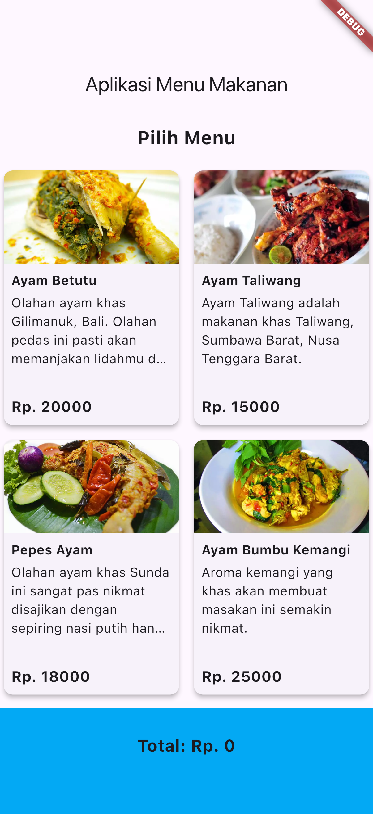

# menu_makanan
## lib/menu_page.dart
```dart
import 'package:flutter/material.dart';
import 'package:menu_makanan/menu.dart';
import 'package:menu_makanan/pesan_page.dart';

//ignore: must_be_immutable
class MenuPage extends StatelessWidget {
  MenuPage({super.key});
  List<Menu> listMenu = [];
  void dummyMenu() {
    listMenu.add(Menu(
        nama: 'Sate Ayam',
        deskripsi: "Sate yang dibuat dari Ayam",
        harga: 20000,
        gambar: 'sate.jpg'));
    listMenu.add(Menu(
        nama: "Soto Ayam",
        deskripsi: "Soto ayam gurih kuah kental kentul",
        harga: 15000,
        gambar: 'soto.jpg'));
    listMenu.add(Menu(
        nama: "Bubur Ayam",
        deskripsi: "Bubur Ayam Jakarta",
        harga: 18000,
        gambar: 'bubur.jpg'));
    listMenu.add(Menu(
        nama: "Steak",
        deskripsi: "Steak ala Waroeng",
        harga: 25000,
        gambar: 'steak.jpg'));
    listMenu.add(Menu(
        nama: "Es Teh Ajib",
        deskripsi: "Es Teh Ajib segar menyegarkan #estehajib",
        harga: 3000,
        gambar: 'esteh1.jpg'));
  }

  @override
  Widget build(BuildContext context) {
    dummyMenu();
    return Scaffold(
      appBar: AppBar(title: const Text('Aplikasi Menu Makanan')),
      body: Column(children: [
        const SizedBox(
          width: double.infinity,
          child: Text("Pilih Menu"),
        ),
        Expanded(
          child: ListView.builder(
              itemCount: listMenu.length,
              shrinkWrap: true,
              itemBuilder: (BuildContext context, int index) {
                return ListTile(
                  leading:
                      Image.asset('assets/images/${listMenu[index].gambar}'),
                  title: Container(
                      padding: const EdgeInsets.only(bottom: 10),
                      child: Text(listMenu[index].nama)),
                  subtitle: Column(
                    crossAxisAlignment: CrossAxisAlignment.start,
                    children: [
                      Text(listMenu[index].deskripsi),
                      Text("Rp. ${listMenu[index].harga}")
                    ],
                  ),
                  trailing: ElevatedButton(
                    child: const Text("Pesan"),
                    onPressed: () {
                      Navigator.push(
                          context,
                          MaterialPageRoute(
                              builder: (context) =>
                                  PesanPage(pesananMenu: listMenu[index])));
                    },
                  ),
                );
              }),
        )
      ]),
    );
  }
}

```
## lib/menu.dart
```dart
class Menu {
  String nama;
  String deskripsi;
  int harga;
  String? gambar;
  Menu(
      {required this.nama,
      required this.deskripsi,
      required this.harga,
      this.gambar});
}

```
## lib/nota_page.dart
```dart
import 'package:flutter/material.dart';
import 'package:menu_makanan/menu.dart';
import 'package:menu_makanan/menu_page.dart';

//ignore: must_be_immutable
class NotaPage extends StatelessWidget {
  NotaPage({super.key, required this.pesanan, required this.jumlah});
  Menu pesanan;
  int jumlah;
  @override
  Widget build(BuildContext context) {
    return Scaffold(
        appBar: AppBar(title: const Text("Nota Anda")),
        body: Column(
          children: [
            const Text("Pemesanan"),
            Text(pesanan.nama),
            Text("${pesanan.harga} x $jumlah"),
            const Text("Berhasil Disimpan"),
            const Text("Total Bayar:"),
            Text((pesanan.harga * jumlah).toString()),
            ElevatedButton(
                onPressed: () {
                  Navigator.of(context).pushAndRemoveUntil(
                      MaterialPageRoute(builder: (context) => MenuPage()),
                      (Route<dynamic> r) => false);
                },
                child: const Text("Kembali ke Menu"))
          ],
        ));
  }
}

```
## lib/pesan_page.dart
```dart
import 'package:flutter/material.dart';
//import 'package:flutter/services.dart';
import 'package:menu_makanan/menu.dart';
import 'package:menu_makanan/nota_page.dart';

//ignore: must_be_immutable
class PesanPage extends StatefulWidget {
  PesanPage({super.key, required this.pesananMenu});
  Menu pesananMenu;
  @override
  State<StatefulWidget> createState() => _PesanPage(pesananMenu: pesananMenu);
}

class _PesanPage extends State {
  _PesanPage({required this.pesananMenu});
  Menu pesananMenu;
  int total = 0;
  int curJml = 0;
  TextEditingController jmlCtrl = TextEditingController();
  @override
  void initState() {
    super.initState();
    jmlCtrl.text = '0';
  }

  void changeJml(String op) {
    curJml = int.tryParse(jmlCtrl.text.toString()) ?? 0;
    if (op == '+') {
      curJml++;
    } else if (op == '-') {
      curJml--;
    }
    jmlCtrl.text = curJml.toString();
    setState(() {
      total = curJml * pesananMenu.harga;
    });
  }

  @override
  Widget build(BuildContext context) {
    return Scaffold(
      appBar: AppBar(title: const Text("Pesanan Anda")),
      body: Column(
        children: [
          Image.asset('assets/images/${pesananMenu.gambar}'),
          Container(
              margin: const EdgeInsets.only(top: 20),
              child: Text(pesananMenu.nama)),
          Container(
            margin: const EdgeInsets.only(top: 10),
            child: Text(pesananMenu.deskripsi),
          ),
          Container(
            child: Text("Rp. ${pesananMenu.harga}"),
          ),
          Row(
            children: [
              Center(
                child: Ink(
                  decoration: const ShapeDecoration(
                      shape: CircleBorder(), color: Colors.pink),
                  child: IconButton(
                      onPressed: () {
                        changeJml('-');
                      },
                      color: Colors.amber,
                      icon: const Icon(Icons.remove, size: 20)),
                ),
              ),
              SizedBox(width: 70, child: TextField(controller: jmlCtrl)),
              IconButton(
                  onPressed: () {
                    changeJml('+');
                  },
                  color: Colors.greenAccent,
                  icon: const Icon(Icons.add, size: 10)),
              Expanded(child: Text(total.toString())),
            ],
          ),
          SizedBox(
              width: double.infinity,
              child: ElevatedButton(
                  onPressed: () {
                    Navigator.push(
                        context,
                        MaterialPageRoute(
                            builder: (context) => NotaPage(
                                pesanan: pesananMenu, jumlah: curJml)));
                  },
                  child: const Text("Pesan Sekarang")))
        ],
      ),
    );
  }
}

```
## lib/main.dart
```dart
import 'package:flutter/material.dart';
import 'package:menu_makanan/menu_page.dart';

void main() {
  runApp(const MainApp());
}

class MainApp extends StatelessWidget {
  const MainApp({super.key});
  @override
  Widget build(BuildContext context) {
    return MaterialApp(
      title: "Aplikasi Pemesanan Makanan",
      home: MenuPage(),
    );
  }
}

```
## OUTPUT
<div style="page-break-after: always\; visibility: hidden">
\pagebreak
</div>

# ayamku
## lib/menu_page.dart
```dart
import 'package:flutter/material.dart';
import 'package:ayamku/menu.dart';

class MenuPage extends StatefulWidget {
  const MenuPage({super.key});

  @override
  _MenuPageState createState() => _MenuPageState();
}

class _MenuPageState extends State<MenuPage> {
  late List<Menu> listMenu;
  int totalHarga = 0; // Variabel untuk menyimpan total harga

  @override
  void initState() {
    super.initState();
    listMenu = _initializeMenu();
  }

  List<Menu> _initializeMenu() {
    return [
      Menu(
        nama: 'Ayam Betutu',
        deskripsi:
            "Olahan ayam khas Gilimanuk, Bali. Olahan pedas ini pasti akan memanjakan lidahmu dengan bumbu kuning yang lezat.",
        harga: 20000,
        gambar: 'ayam_betutu.jpg',
      ),
      Menu(
        nama: "Ayam Taliwang",
        deskripsi:
            "Ayam Taliwang adalah makanan khas Taliwang, Sumbawa Barat, Nusa Tenggara Barat.",
        harga: 15000,
        gambar: 'ayam_taliwang.jpg',
      ),
      Menu(
        nama: "Pepes Ayam",
        deskripsi:
            "Olahan ayam khas Sunda ini sangat pas nikmat disajikan dengan sepiring nasi putih hangat.",
        harga: 18000,
        gambar: 'pepes_ayam.jpg',
      ),
      Menu(
        nama: "Ayam Bumbu Kemangi",
        deskripsi:
            "Aroma kemangi yang khas akan membuat masakan ini semakin nikmat.",
        harga: 25000,
        gambar: 'ayam_bumbu_kemangi.jpg',
      ),
      Menu(
        nama: "Ayam Rica-Rica",
        deskripsi: "Ayam juga nikmat dimasak rica-rica.",
        harga: 30000,
        gambar: 'ayam_rica_rica.jpg',
      ),
      Menu(
        nama: "Ayam Panggang",
        deskripsi: "Ayam panggang bisa kamu beli di banyak tempat makan.",
        harga: 30000,
        gambar: "ayam_panggang.jpg",
      ),
    ];
  }

  void _tambahKeTotal(int harga) {
    setState(() {
      totalHarga += harga; // Tambahkan harga menu ke total
    });
  }

  @override
  Widget build(BuildContext context) {
    return Scaffold(
      appBar: AppBar(title: const Text('Aplikasi Menu Makanan')),
      body: SingleChildScrollView(
        child: Column(
          children: [
            const Padding(
              padding: EdgeInsets.all(16.0),
              child: Text(
                "Pilih Menu",
                style: TextStyle(fontSize: 20, fontWeight: FontWeight.bold),
              ),
            ),
            GridView.builder(
              gridDelegate: const SliverGridDelegateWithFixedCrossAxisCount(
                crossAxisCount: 2,
                crossAxisSpacing: 8.0,
                mainAxisSpacing: 8.0,
                childAspectRatio: 0.7, // Mengatur aspect ratio untuk card
              ),
              itemCount: listMenu.length,
              shrinkWrap: true,
              physics: const NeverScrollableScrollPhysics(),
              itemBuilder: (context, index) {
                return _buildMenuCard(context, listMenu[index]);
              },
            ),
          ],
        ),
      ),
      bottomNavigationBar: BottomAppBar(
        color: Colors.lightBlue,
        elevation: 4.0,
        child: Padding(
          padding: const EdgeInsets.all(16.0),
          child: Text(
            "Total: Rp. $totalHarga", // Tampilkan total di bagian bawah layar
            style: const TextStyle(fontSize: 18, fontWeight: FontWeight.bold),
            textAlign: TextAlign.center,
          ),
        ),
      ),
    );
  }

  Widget _buildMenuCard(BuildContext context, Menu menu) {
    return GestureDetector(
      onTap: () {
        _tambahKeTotal(
            menu.harga); // Tambahkan harga menu ke total saat di-klik
      },
      child: Card(
        elevation: 4.0,
        shape: RoundedRectangleBorder(borderRadius: BorderRadius.circular(10)),
        child: Column(
          crossAxisAlignment: CrossAxisAlignment.stretch,
          children: [
            ClipRRect(
              borderRadius:
                  const BorderRadius.vertical(top: Radius.circular(10)),
              child: Image.asset(
                'assets/images/${menu.gambar}',
                fit: BoxFit.cover,
                height: 100,
                width: double.infinity,
              ),
            ),
            Expanded(
              child: Padding(
                padding: const EdgeInsets.all(8.0),
                child: Column(
                  crossAxisAlignment: CrossAxisAlignment.start,
                  children: [
                    Text(
                      menu.nama,
                      maxLines: 1,
                      style: const TextStyle(
                          fontSize: 14, fontWeight: FontWeight.bold),
                    ),
                    const SizedBox(height: 4),
                    Text(
                      menu.deskripsi,
                      maxLines: 4,
                      overflow: TextOverflow.ellipsis,
                      style: const TextStyle(fontSize: 14),
                    ),
                    const Spacer(),
                    Text(
                      "Rp. ${menu.harga}",
                      style: const TextStyle(
                        fontSize: 16,
                        fontWeight: FontWeight.bold,
                      ),
                    ),
                  ],
                ),
              ),
            ),
          ],
        ),
      ),
    );
  }
}

```
## lib/menu.dart
```dart
class Menu {
  String nama;
  String deskripsi;
  int harga;
  String? gambar;
  Menu(
      {required this.nama,
      required this.deskripsi,
      required this.harga,
      this.gambar});
}

```
## lib/main.dart
```dart
import 'package:flutter/material.dart';
import 'package:ayamku/menu_page.dart';
import 'package:flutter_driver/driver_extension.dart';

void main() {
  enableFlutterDriverExtension();
  runApp(const MainApp());
}

class MainApp extends StatelessWidget {
  const MainApp({super.key});
  @override
  Widget build(BuildContext context) {
    return const MaterialApp(
      title: "Aplikasi Pemesanan Makanan",
      home: MenuPage(),
    );
  }
}

```
## OUTPUT
{ width=200px } \ \ 
{ width=200px } \ \ 
<div style="page-break-after: always\; visibility: hidden">
\pagebreak
</div>

