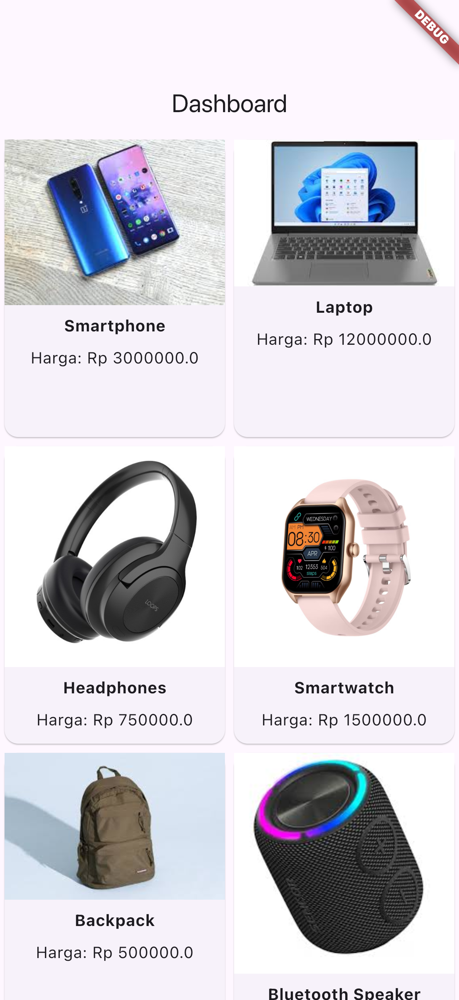
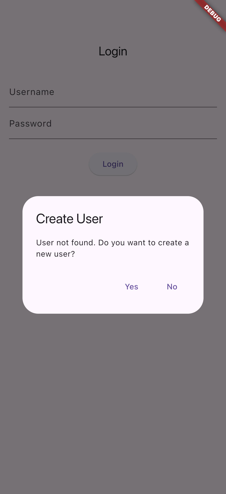
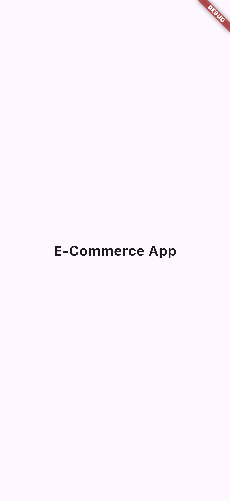
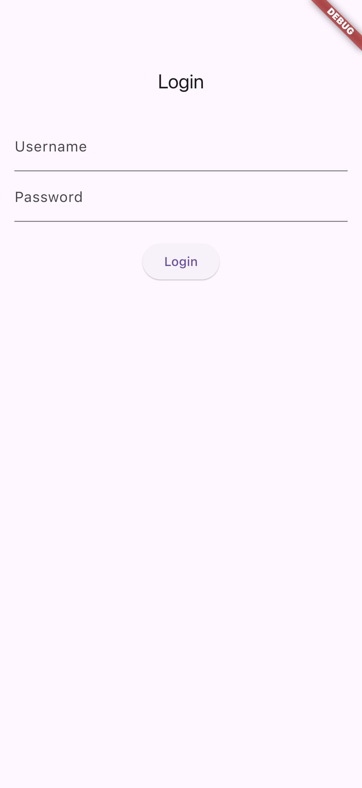

# ecommerce_app
## lib/models/product.dart
```dart
class Product {
  final String id;
  final String name;
  final String imageUrl;
  final String description;
  final double price;

  Product({
    required this.id,
    required this.name,
    required this.imageUrl,
    required this.description,
    required this.price,
  });

  factory Product.fromJson(Map<String, dynamic> json) {
    return Product(
      id: json['id'],
      name: json['name'],
      imageUrl: json['imageUrl'],
      description: json['description'],
      price: json['price'].toDouble(), // Pastikan untuk mengonversi ke double
    );
  }
}

```
## lib/main.dart
```dart
import 'package:flutter/material.dart';
import 'pages/splash_page.dart';
import 'package:flutter_driver/driver_extension.dart';

void main() {
  enableFlutterDriverExtension();
  runApp(const MyApp());
}

class MyApp extends StatelessWidget {
  const MyApp({super.key});

  @override
  Widget build(BuildContext context) {
    return MaterialApp(
      title: 'E-Commerce App',
      theme: ThemeData(
        primarySwatch: Colors.blue,
      ),
      home: const SplashPage(),
    );
  }
}

```
## lib/pages/product_detail_page.dart
```dart
import 'package:flutter/material.dart';
import '../models/product.dart';


class ProductDetailPage extends StatelessWidget {
  final Product product;

  const ProductDetailPage({super.key, required this.product});

  @override
  Widget build(BuildContext context) {
    return Scaffold(
      appBar: AppBar(
        title: Text(product.name),
      ),
      body: Padding(
        padding: const EdgeInsets.all(16.0),
        child: Column(
          crossAxisAlignment: CrossAxisAlignment.start,
          children: [
            Image.asset(product.imageUrl, fit: BoxFit.cover),
            const SizedBox(height: 16),
            Text(
              product.name,
              style: const TextStyle(fontSize: 24, fontWeight: FontWeight.bold),
            ),
            const SizedBox(height: 8),
            Text('Harga: Rp ${product.price.toString()}', style: const TextStyle(fontSize: 18)),
            const SizedBox(height: 8),
            Text(product.description),
          ],
        ),
      ),
    );
  }
}

```
## lib/pages/splash_page.dart
```dart
import 'package:flutter/material.dart';
import 'login_page.dart';

class SplashPage extends StatelessWidget {
  const SplashPage({super.key});

  @override
  Widget build(BuildContext context) {
    Future.delayed(const Duration(seconds: 3), () {
      Navigator.pushReplacement(
        context,
        MaterialPageRoute(builder: (context) => const LoginPage()),
      );
    });

    return const Scaffold(
      body: Center(
        child: Text(
          'E-Commerce App',
          style: TextStyle(fontSize: 24, fontWeight: FontWeight.bold),
        ),
      ),
    );
  }
}

```
## lib/pages/login_page.dart
```dart
import 'package:flutter/material.dart';
import 'package:shared_preferences/shared_preferences.dart';
import 'dashboard_page.dart';

class LoginPage extends StatefulWidget {
  const LoginPage({super.key});

  @override
  _LoginPageState createState() => _LoginPageState();
}

class _LoginPageState extends State<LoginPage> {
  final _usernameController = TextEditingController();
  final _passwordController = TextEditingController();
  String? _savedUsername;
  String? _savedPassword;

  @override
  void initState() {
    super.initState();
    _loadUserData();
  }

  _loadUserData() async {
    SharedPreferences prefs = await SharedPreferences.getInstance();
    setState(() {
      _savedUsername = prefs.getString('username');
      _savedPassword = prefs.getString('password');
    });
  }

  _login() async {
    if (_usernameController.text == _savedUsername &&
        _passwordController.text == _savedPassword) {
      Navigator.pushReplacement(
        context,
        MaterialPageRoute(builder: (context) => const DashboardPage()),
      );
    } else {
      _showCreateUserDialog();
    }
  }

  _createUser() async {
    SharedPreferences prefs = await SharedPreferences.getInstance();
    prefs.setString('username', _usernameController.text);
    prefs.setString('password', _passwordController.text);
    Navigator.pushReplacement(
      context,
      MaterialPageRoute(builder: (context) => const DashboardPage()),
    );
  }

  _showCreateUserDialog() {
    showDialog(
      context: context,
      builder: (context) {
        return AlertDialog(
          title: const Text('Create User'),
          content: const Text('User not found. Do you want to create a new user?'),
          actions: [
            TextButton(
              key: const ValueKey('btn_register'),
              onPressed: () {
                _createUser();
                Navigator.of(context).pop();
              },
              child: const Text('Yes'),
            ),
            TextButton(
              onPressed: () {
                Navigator.of(context).pop();
              },
              child: const Text('No'),
            ),
          ],
        );
      },
    );
  }

  @override
  Widget build(BuildContext context) {
    return Scaffold(
      appBar: AppBar(title: const Text('Login')),
      body: Padding(
        padding: const EdgeInsets.all(16.0),
        child: Column(
          children: [
            TextField(
              controller: _usernameController,
              decoration: const InputDecoration(labelText: 'Username'),
            ),
            TextField(
              controller: _passwordController,
              decoration: const InputDecoration(labelText: 'Password'),
              obscureText: true,
            ),
            const SizedBox(height: 20),
            ElevatedButton(
              key: const ValueKey('btn_login'),
              onPressed: _login,
              child: const Text('Login'),
            ),
          ],
        ),
      ),
    );
  }
}

```
## lib/pages/dashboard_page.dart
```dart
import 'package:ecommerce_app/pages/product_detail_page.dart';
import 'package:flutter/material.dart';
import 'package:flutter/services.dart';
import 'dart:convert';
import 'package:ecommerce_app/models/product.dart';

class DashboardPage extends StatefulWidget {
  const DashboardPage({super.key});

  @override
  _DashboardPageState createState() => _DashboardPageState();
}

class _DashboardPageState extends State<DashboardPage> {
  List<Product> products = [];

  @override
  void initState() {
    super.initState();
    _loadProducts();
  }

  Future<void> _loadProducts() async {
    try {
      String data = await rootBundle.loadString('assets/products.json');
      final List<dynamic> jsonResult = json.decode(data);
      setState(() {
        products = jsonResult.map((json) => Product.fromJson(json)).toList();
      });
    } catch (e) {
      print('Error loading products: $e');
    }
  }

  @override
  Widget build(BuildContext context) {
    return Scaffold(
      appBar: AppBar(
        title: const Text('Dashboard'),
      ),
      body: GridView.builder(
        gridDelegate: const SliverGridDelegateWithFixedCrossAxisCount(
          crossAxisCount: 2,
          childAspectRatio: 0.75,
        ),
        itemCount: products.length,
        itemBuilder: (context, index) {
          final product = products[index];
          return Card(
            key: ValueKey('product_item_$index'),
            child: GestureDetector(
              onTap: () {
                Navigator.push(
                  context,
                  MaterialPageRoute(
                    builder: (context) => ProductDetailPage(product: product),
                  ),
                );
              },
              child: Column(
                children: [
                  Image.asset(product.imageUrl, fit: BoxFit.cover),
                  Padding(
                    padding: const EdgeInsets.all(8.0),
                    child: Text(
                      product.name,
                      style: const TextStyle(fontWeight: FontWeight.bold),
                    ),
                  ),
                  Text('Harga: Rp ${product.price.toString()}'),
                ],
              ),
            ),
          );
        },
      ),
    );
  }
}

```
## OUTPUT
{ width=200px } \ \ 
{ width=200px } \ \ 
{ width=200px } \ \ 
{ width=200px } \ \ 
<div style="page-break-after: always\; visibility: hidden">
\pagebreak
</div>

# login_app
## lib/register_page.dart
```dart
import 'package:flutter/material.dart';
import 'package:shared_preferences/shared_preferences.dart';

class RegisterPage extends StatefulWidget {
  const RegisterPage({super.key});

  @override
  _RegisterPageState createState() => _RegisterPageState();
}

class _RegisterPageState extends State<RegisterPage> {
  final TextEditingController _usernameController = TextEditingController();
  final TextEditingController _passwordController = TextEditingController();
  String _message = '';

  Future<void> _createUser() async {
    SharedPreferences prefs = await SharedPreferences.getInstance();
    String? storedPassword = prefs.getString(_usernameController.text);

    if (storedPassword == null) {
      await prefs.setString(_usernameController.text, _passwordController.text);
      _message = 'Akun berhasil dibuat!';
    } else {
      _message = 'Username sudah terdaftar.';
    }

    setState(() {});
  }

  @override
  Widget build(BuildContext context) {
    return Scaffold(
      appBar: AppBar(title: const Text('Buat Akun')),
      body: Padding(
        padding: const EdgeInsets.all(16.0),
        child: Column(
          children: [
            TextField(
              controller: _usernameController,
              decoration: const InputDecoration(labelText: 'Username'),
            ),
            TextField(
              controller: _passwordController,
              decoration: const InputDecoration(labelText: 'Password'),
              obscureText: true,
            ),
            const SizedBox(height: 20),
            ElevatedButton(
              onPressed: _createUser,
              child: const Text('Buat Akun'),
            ),
            const SizedBox(height: 20),
            Text(_message, style: const TextStyle(color: Colors.red)),
          ],
        ),
      ),
    );
  }
}

```
## lib/success_page.dart
```dart
import 'package:flutter/material.dart';

class SuccessPage extends StatelessWidget {
  const SuccessPage({super.key});

  @override
  Widget build(BuildContext context) {
    return Scaffold(
      appBar: AppBar(title: const Text('Login Berhasil')),
      body: const Center(
        child: Text(
          'Login Berhasil!',
          style: TextStyle(fontSize: 24),
        ),
      ),
    );
  }
}

```
## lib/main.dart
```dart
import 'package:flutter/material.dart';
import 'login_page.dart';

void main() {
  runApp(const MyApp());
}

class MyApp extends StatelessWidget {
  const MyApp({super.key});

  @override
  Widget build(BuildContext context) {
    return MaterialApp(
      title: 'Flutter Login',
      theme: ThemeData(
        primarySwatch: Colors.blue,
      ),
      home: const LoginPage(),
    );
  }
}

```
## lib/login_page.dart
```dart
import 'package:flutter/material.dart';
import 'package:shared_preferences/shared_preferences.dart';
import 'register_page.dart';
import 'success_page.dart'; // Import halaman sukses

class LoginPage extends StatefulWidget {
  const LoginPage({super.key});

  @override
  _LoginPageState createState() => _LoginPageState();
}

class _LoginPageState extends State<LoginPage> {
  final TextEditingController _usernameController = TextEditingController();
  final TextEditingController _passwordController = TextEditingController();
  String _message = '';

  Future<void> _login() async {
    SharedPreferences prefs = await SharedPreferences.getInstance();
    String? storedPassword = prefs.getString(_usernameController.text);

    if (storedPassword == null) {
      _message = 'User tidak ada. Silakan buat akun.';
    } else if (storedPassword == _passwordController.text) {
      Navigator.pushReplacement(
        context,
        MaterialPageRoute(builder: (context) => const SuccessPage()),
      );
    } else {
      _message = 'Password salah. Silakan coba lagi.';
    }

    setState(() {});
  }

  @override
  Widget build(BuildContext context) {
    return Scaffold(
      appBar: AppBar(title: const Text('Login')),
      body: Padding(
        padding: const EdgeInsets.all(16.0),
        child: Column(
          children: [
            TextField(
              controller: _usernameController,
              decoration: const InputDecoration(labelText: 'Username'),
            ),
            TextField(
              controller: _passwordController,
              decoration: const InputDecoration(labelText: 'Password'),
              obscureText: true,
            ),
            const SizedBox(height: 20),
            ElevatedButton(
              onPressed: _login,
              child: const Text('Login'),
            ),
            ElevatedButton(
              onPressed: () {
                Navigator.push(
                  context,
                  MaterialPageRoute(builder: (context) => const RegisterPage()),
                );
              },
              child: const Text('Buat Akun'),
            ),
            const SizedBox(height: 20),
            Text(_message, style: const TextStyle(color: Colors.red)),
          ],
        ),
      ),
    );
  }
}

```
## OUTPUT
<div style="page-break-after: always\; visibility: hidden">
\pagebreak
</div>

# estehajib
## lib/blank_screen.dart
```dart
import 'package:flutter/material.dart';

class Blankscreen extends StatelessWidget {
  const Blankscreen({super.key});
  @override
  Widget build(BuildContext context) {
    return const Scaffold(
      backgroundColor: Color(0xff65005C),
      body: Column(
        mainAxisAlignment: MainAxisAlignment.center,
        crossAxisAlignment: CrossAxisAlignment.center,
        children: [
          Center(
            child: SizedBox(
              height: 24.0,
            ),
          ),
          Text(
            "Es Teh Ajib",
            textAlign: TextAlign.center,
            style: TextStyle(
              color: Colors.white,
              fontWeight: FontWeight.bold,
              fontSize: 35.0,
            ),
          ),
          Text(
            "Menu segar menyegarkan #estehajib",
            textAlign: TextAlign.center,
            style: TextStyle(
              color: Colors.white,
              fontWeight: FontWeight.bold,
              fontSize: 20.0,
            ),
          ),
        ],
      ),
    );
  }
}

```
## lib/main.dart
```dart
import 'package:flutter/material.dart';
import 'package:estehajib/splash_screen.dart';

void main() {
  runApp(const MyApp());
}

class MyApp extends StatelessWidget {
  const MyApp({super.key});
  // This widget is the root of your application.
  @override
  Widget build(BuildContext context) {
    return MaterialApp(
      debugShowCheckedModeBanner: false,
      title: 'Aplikasi Es Teh Ajib',
      theme: ThemeData(
        primarySwatch: Colors.blue,
      ),
      home: const SplashScreen(),
    );
  }
}

```
## lib/splash_screen.dart
```dart
import 'dart:async';
import 'package:estehajib/blank_screen.dart';
import 'package:flutter/material.dart';

class SplashScreen extends StatefulWidget {
  const SplashScreen({super.key});
  @override
  State<SplashScreen> createState() => _SplashScreenState();
}

class _SplashScreenState extends State<SplashScreen> {
  startSplashScreen() async {
    var duration = const Duration(seconds: 5);
    return Timer(duration, () {
      Navigator.pushReplacement(context,
          MaterialPageRoute(builder: (context) => const Blankscreen()));
    });
  }

  @override
  void initState() {
    super.initState();
    startSplashScreen();
  }

  @override
  Widget build(BuildContext context) {
    return Scaffold(
      backgroundColor: Colors.blueGrey,
      body: Column(
        mainAxisAlignment: MainAxisAlignment.center,
        crossAxisAlignment: CrossAxisAlignment.center,
        children: [
          Center(
            child: Image.asset(
              "assets/Estehajib-Jumbo.png",
              width: 200.0,
              height: 100.0,
              fit: BoxFit.contain,
            ),
          ),
          const SizedBox(
            height: 24.0,
          ),
          const Text(
            "Es Teh Ajib",
            style: TextStyle(
              color: Colors.white,
              fontWeight: FontWeight.bold,
              fontSize: 35.0,
            ),
          ),
        ],
      ),
    );
  }
}

```
## OUTPUT
<div style="page-break-after: always\; visibility: hidden">
\pagebreak
</div>

# flutter_shared_preferences
## lib/main.dart
```dart
import 'package:flutter/material.dart';
import 'package:shared_preferences/shared_preferences.dart';

void main() => runApp(const MyApp());

class MyApp extends StatelessWidget {
  const MyApp({super.key});
  @override
  Widget build(BuildContext context) {
    return MaterialApp(
      title: 'Shared Preferences',
      theme: ThemeData(
        primarySwatch: Colors.blue,
      ),
      home: const MyHomePage(),
    );
  }
}

class MyHomePage extends StatefulWidget {
  const MyHomePage({super.key});
  @override
  State<MyHomePage> createState() => _MyHomePageState();
}

class _MyHomePageState extends State<MyHomePage> {
  String? email = "";
  String? password = "";
  TextEditingController emailController = TextEditingController();
  TextEditingController passwordController = TextEditingController();
  @override
  Widget build(BuildContext context) {
    return Scaffold(
      appBar: AppBar(title: const Text('Flutter Shared Preferences')),
      body: ListView(
        padding: const EdgeInsets.all(8.0),
        children: [
          // input email
          TextField(
              controller: emailController,
              decoration: InputDecoration(
                  labelText: "Email",
                  border: OutlineInputBorder(
                      borderRadius: BorderRadius.circular(5.0)))),
          const Padding(padding: EdgeInsets.only(top: 4)),
          // input password
          TextField(
              controller: passwordController,
              decoration: InputDecoration(
                  labelText: "Password",
                  border: OutlineInputBorder(
                      borderRadius: BorderRadius.circular(5.0)))),
// button untuk menyimpan email dan password ke dalam Shared Preferences melalui method
          // setIntoSharedPreferences()
          ElevatedButton(
            child: const Text("Set"),
            onPressed: () {
              setIntoSharedPreferences();
            },
          ),
          const Padding(padding: EdgeInsets.only(top: 8)),
          // Menampilkan Email pada Text Widget
          Text(
            "Your Email : $email",
            style: const TextStyle(fontSize: 20),
          ),
          // Menampilkan password pada Text Widget
          Text(
            "Your Password : $password",
            style: const TextStyle(fontSize: 20),
          ),
// Button yang berfungsi memanggil method getFromSharedPreferences() untuk menampilkan
          // Email dan Password pada Text Widget
          ElevatedButton(
            child: const Text("Get"),
            onPressed: () {
              getFromSharedPreferences();
            },
          ),
        ],
      ),
    );
  }

// method ini berfungsi untuk memasukkan data ke dalam SharedPreferences
  void setIntoSharedPreferences() async {
    SharedPreferences prefs = await SharedPreferences.getInstance();
    await prefs.setString("email", emailController.text);
    await prefs.setString("password", passwordController.text);
  }

// Method ini berfungsi untuk mengambil data Email dan Password dari SharedPreferences
// kemudian dimasukkan ke variable email dan password
  void getFromSharedPreferences() async {
    SharedPreferences prefs = await SharedPreferences.getInstance();
    setState(() {
      email = prefs.getString("email");
      password = prefs.getString("password");
    });
  }
}

```
## OUTPUT
<div style="page-break-after: always\; visibility: hidden">
\pagebreak
</div>

# latihan_json
## lib/book_model.dart
```dart
class BookModel {
  final String judul;
  final int halaman;
  final bool isBestSeller;
  BookModel({
    required this.judul,
    required this.halaman,
    required this.isBestSeller,
  });
  factory BookModel.fromJSON(Map<String, dynamic> json) => BookModel(
        judul: json['judul'],
        halaman: json['halaman'],
        isBestSeller: json['best_seller'],
      );
}

```
## lib/main.dart
```dart
import 'package:flutter/material.dart';
import 'package:latihan_json/book_model.dart';
import 'package:latihan_json/book_services.dart';

void main() {
  runApp(const MyApp());
}

class MyApp extends StatelessWidget {
  const MyApp({super.key});
  // This widget is the root of your application.
  @override
  Widget build(BuildContext context) {
    return MaterialApp(
      title: 'Flutter Demo',
      theme: ThemeData(
// This is the theme of your application. //
// Try running your application with "flutter run". You'll see the
// application has a blue toolbar. Then, without quitting the app, try
// changing the primarySwatch below to Colors.green and then invoke
// "hot reload" (press "r" in the console where you ran "flutter run",
// or simply save your changes to "hot reload" in a Flutter IDE).
// Notice that the counter didn't reset back to zero; the application // is not restarted.
        primarySwatch: Colors.blue,
      ),
      home: const BookPage(),
    );
  }
}

class BookPage extends StatefulWidget {
  const BookPage({super.key});
  @override
  State<BookPage> createState() =>
      _BookPageState(); //_BookPageState createState() => _BookPageState();
}

class _BookPageState extends State<BookPage> {
  @override
  Widget build(BuildContext context) {
    return Scaffold(
      appBar: AppBar(
        title: const Text('Halaman Buku'),
      ),
      body: FutureBuilder<List<BookModel>>(
          future: BookServices.getBooksFromJSON(),
          builder: (context, snapshoot) {
            if (snapshoot.connectionState == ConnectionState.done) {
              return ListView.builder(
                  itemCount: snapshoot.data!.length,
                  itemBuilder: (context, index) {
                    final book = snapshoot.data![index];
                    return ListTile(
                      title: Text(book.judul),
                      subtitle: Text(
                        'Jumlah halaman : ${book.halaman}',
                      ),
                      trailing: book.isBestSeller
                          ? Chip(
                              label: Text(
                                'Best Seller',
                                style: Theme.of(context)
                                    .textTheme
                                    .labelLarge!
                                    .copyWith(
                                      color: Colors.white,
                                    ),
                              ),
                              backgroundColor: Colors.blue)
                          : const SizedBox.shrink(),
                    );
                  });
            } else {
              return const Center(
                child: CircularProgressIndicator(),
              );
            }
          }),
    );
  }
}

```
## lib/book_services.dart
```dart
import 'dart:convert';
//untuk mengakses file assets
import 'package:flutter/services.dart';
import 'book_model.dart';

class BookServices {
  static Future<List<BookModel>> getBooksFromJSON() async {
    try {
      final result =
          jsonDecode(await rootBundle.loadString('assets/book.json')) as List;
      return result.map((book) => BookModel.fromJSON(book)).toList();
    } catch (e) {
      throw Exception(e);
    }
  }
}

```
## OUTPUT
<div style="page-break-after: always\; visibility: hidden">
\pagebreak
</div>

