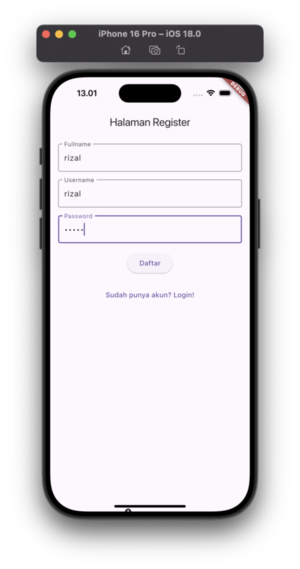
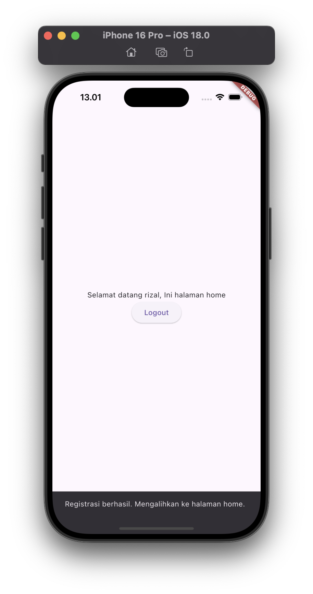
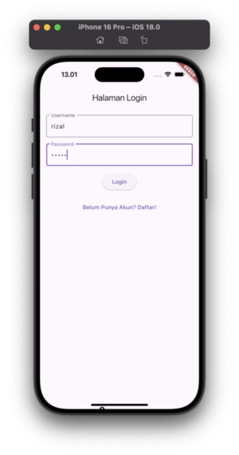
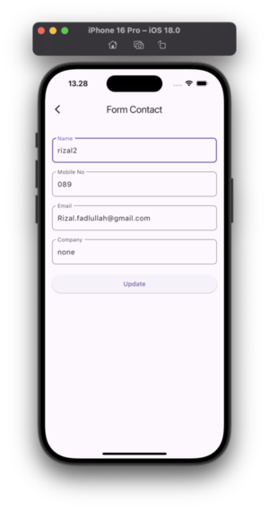
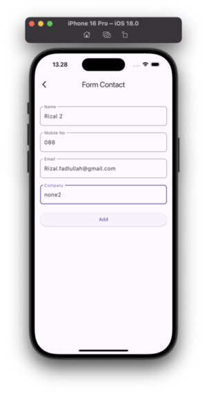
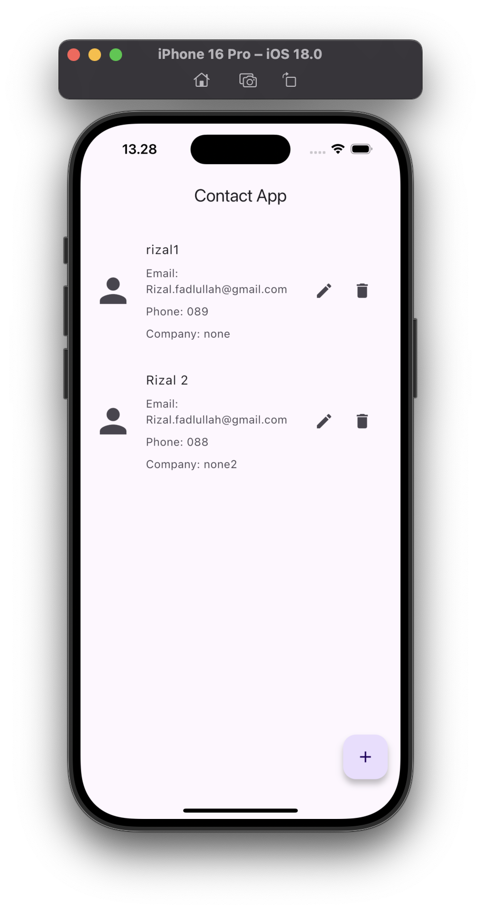
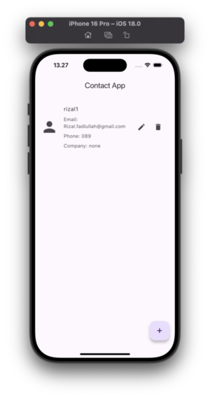

# TUGAS_1
## lib/repositories/repositories.dart
```dart
export 'user_repository.dart';
```
## lib/repositories/user_repository.dart
```dart
import 'package:sqflite/sqflite.dart';
import 'package:tugas_1/models/models.dart';
import 'package:tugas_1/services/services.dart';

class UserRepository {
  final tableName = 'users';

  Future<User?> getUserByUsername(String username) async {
    final db = await DBService.getDatabase();
    final result = await db.query(
      tableName,
      columns: [
        'id',
        'fullname',
        'username',
        'password',
      ],
      where: 'username = ?',
      whereArgs: [username],
    );

    db.close();

    if (result.isNotEmpty) {
      return User.fromMap(result.first);
    } else {
      return null;
    }
  }

  Future<void> addUser(User newUser) async {
    final db = await DBService.getDatabase();
    await db.insert(
      tableName,
      newUser.toMap(),
      conflictAlgorithm: ConflictAlgorithm.replace,
    );
    db.close();
  }
}

```
## lib/models/user.dart
```dart
class User {
  int? _id;
  String? fullname;
  String username;
  String password;

  User({
    this.fullname,
    required this.username,
    required this.password,
    int? id,
  }) : _id = id;

  int? get id => _id;

  set id(int? id) {
    if (_id == null) {
      _id = id;
    } else {
      throw Exception('ID sudah diatur dan tidak bisa diubah lagi.');
    }
  }

  Map<String, dynamic> toMap() {
    return {
      'id': _id,
      'fullname': fullname,
      'username': username,
      'password': password,
    };
  }

  factory User.fromMap(Map<String, dynamic> map) {
    final user = User(
      fullname: map['fullname'],
      username: map['username'],
      password: map['password'],
      id: map['id'],
    );
    return user;
  }
}

```
## lib/models/models.dart
```dart
export 'user.dart';
```
## lib/main.dart
```dart
import 'package:flutter/material.dart';
import 'package:tugas_1/views/views.dart';

void main() {
  runApp(const App());
}

class App extends StatelessWidget {
  const App({super.key});

  @override
  Widget build(BuildContext context) {
    return MaterialApp(
      initialRoute: '/login',
      routes: {
        '/login': (context) => const LoginPage(),
        '/register': (context) => const RegisterPage(),
        '/main': (context) => const MainPage(),
      },
    );
  }
}

```
## lib/views/register_page.dart
```dart
import 'package:flutter/material.dart';
import 'package:tugas_1/services/services.dart';

class RegisterPage extends StatefulWidget {
  const RegisterPage({super.key});

  @override
  State<RegisterPage> createState() => _RegisterPageState();
}

class _RegisterPageState extends State<RegisterPage> {
  final fullnameController = TextEditingController();
  final usernameController = TextEditingController();
  final passwordController = TextEditingController();
  final auth = AuthService();

  void _registerButtonAction() async {
    final fullname = fullnameController.text.trim();
    final username = usernameController.text.trim();
    final password = passwordController.text.trim();
    final success = await auth.register(fullname, username, password);
    debugPrint(auth.currentUser.toString());

    if (success && mounted) {
      _showSnackBar(content: 'Registrasi berhasil. Mengalihkan ke halaman home.');
      Navigator.of(context).pushReplacementNamed('/main');
    } else {
      _showSnackBar(content: 'Register gagal.');
    }
  }

  void _loginButtonAction() {
    Navigator.pushReplacementNamed(context, '/login');
  }

  void _showSnackBar({required String content}) {
    ScaffoldMessenger.of(context).showSnackBar(
      SnackBar(content: Text(content)),
    );
  }

  @override
  Widget build(BuildContext context) {
    return Scaffold(
      appBar: AppBar(
        title: const Text('Halaman Register'),
      ),
      body: SafeArea(
        child: Padding(
          padding: const EdgeInsets.all(16.0),
          child: Column(
            children: [
              TextField(
                controller: fullnameController,
                decoration: const InputDecoration(
                  labelText: 'Fullname',
                  border: OutlineInputBorder(),
                ),
              ),
              const SizedBox(height: 16),
              TextField(
                controller: usernameController,
                decoration: const InputDecoration(
                  labelText: 'Username',
                  border: OutlineInputBorder(),
                ),
              ),
              const SizedBox(height: 16),
              TextField(
                controller: passwordController,
                obscureText: true,
                decoration: const InputDecoration(
                  labelText: 'Password',
                  border: OutlineInputBorder(),
                ),
              ),
              const SizedBox(height: 16),
              ElevatedButton(
                onPressed: _registerButtonAction,
                child: const Text('Daftar'),
              ),
              const SizedBox(height: 16),
              TextButton(
                onPressed: _loginButtonAction,
                child: const Text('Sudah punya akun? Login!'),
              ),
            ],
          ),
        ),
      ),
    );
  }
}

```
## lib/views/main_page.dart
```dart
import 'package:flutter/material.dart';
import 'package:tugas_1/services/services.dart';

class MainPage extends StatefulWidget {
  const MainPage({super.key});

  @override
  State<MainPage> createState() => _MainPageState();
}

class _MainPageState extends State<MainPage> {
  final auth = AuthService();

  void _logoutButtonAction() {
    final success = auth.logout();
    if (success) {
      Navigator.pushReplacementNamed(context, '/login');
    }
  }

  @override
  Widget build(BuildContext context) {
    return Scaffold(
      body: Center(
        child: Column(
          mainAxisAlignment: MainAxisAlignment.center,
          children: [
            Text(
                'Selamat datang ${auth.currentUser!.fullname}, Ini halaman home'),
            ElevatedButton(
              onPressed: _logoutButtonAction,
              child: const Text('Logout'),
            ),
          ],
        ),
      ),
    );
  }
}

```
## lib/views/login_page.dart
```dart
import 'package:flutter/material.dart';
import 'package:tugas_1/services/services.dart';

class LoginPage extends StatefulWidget {
  const LoginPage({super.key});

  @override
  State<LoginPage> createState() => _LoginPageState();
}

class _LoginPageState extends State<LoginPage> {
  final usernameController = TextEditingController();
  final passwordController = TextEditingController();
  final auth = AuthService();

  void _loginButtonAction() async {
    final username = usernameController.text.trim();
    final password = passwordController.text.trim();
    final success = await auth.login(username, password);

    if (success && mounted) {
      Navigator.of(context).pushReplacementNamed('/main');
    } else {
      _showSnackBar(content: 'Login gagal. Periksa kembali kredensial Anda.');
    }
  }

  void _registerButtonAction() {
    Navigator.pushReplacementNamed(context, '/register');
  }

  void _showSnackBar({required String content}) {
    ScaffoldMessenger.of(context).showSnackBar(
      SnackBar(content: Text(content)),
    );
  }

  @override
  Widget build(BuildContext context) {
    return Scaffold(
      appBar: AppBar(
        title: const Text('Halaman Login'),
      ),
      body: SafeArea(
        child: Padding(
          padding: const EdgeInsets.all(16.0),
          child: Column(
            children: [
              TextField(
                controller: usernameController,
                decoration: const InputDecoration(
                  labelText: 'Username',
                  border: OutlineInputBorder(),
                ),
              ),
              const SizedBox(height: 16),
              TextField(
                controller: passwordController,
                obscureText: true,
                decoration: const InputDecoration(
                  labelText: 'Password',
                  border: OutlineInputBorder(),
                ),
              ),
              const SizedBox(height: 16),
              ElevatedButton(
                onPressed: _loginButtonAction,
                child: const Text('Login'),
              ),
              const SizedBox(height: 16),
              TextButton(
                onPressed: _registerButtonAction,
                child: const Text('Belum Punya Akun? Daftar!'),
              ),
            ],
          ),
        ),
      ),
    );
  }
}

```
## lib/views/views.dart
```dart
export 'login_page.dart';
export 'main_page.dart';
export 'register_page.dart';
```
## lib/services/db_service.dart
```dart
import 'package:sqflite/sqflite.dart';
import 'package:path/path.dart';

class DBService {
  static Database? _database;

  static Future<Database> getDatabase() async {
    if (_database != null) return _database!;

    _database = await _initDB();
    return _database!;
  }

  static Future<Database> _initDB() async {
    final dbPath = await getDatabasesPath();
    final path = join(dbPath, 'app_database.db');

    return await openDatabase(
      path,
      version: 1,
      onCreate: _onCreate,
    );
  }

  static Future<void> _onCreate(Database db, int version) async {
    await db.execute('''
      CREATE TABLE users(
        id INTEGER PRIMARY KEY AUTOINCREMENT,
        fullname TEXT,
        username TEXT,
        password TEXT
      )
    ''');
  }

  static Future<void> close() async {
    final db = await getDatabase();
    db.close();
  }
}

```
## lib/services/auth_service.dart
```dart
import 'dart:convert';
import 'package:crypto/crypto.dart';
import 'package:tugas_1/repositories/repositories.dart';
import 'package:tugas_1/models/models.dart';

class AuthService {
  static final AuthService _instance = AuthService._internal();
  factory AuthService() => _instance;
  AuthService._internal();

  final UserRepository _userRepository = UserRepository();

  User? _currentUser;

  User? get currentUser => _currentUser;

  String _hashPassword(String password) {
    final bytes = utf8.encode(password);
    final digest = sha256.convert(bytes);
    return digest.toString();
  }

  Future<bool> login(String username, String password) async {
    final hashedPassword = _hashPassword(password);
    final user = await _userRepository.getUserByUsername(username);

    if (user != null && user.password == hashedPassword) {
      _currentUser = user;
      return true;
    }

    return false;
  }

  Future<bool> register(
    String fullname,
    String username,
    String password,
  ) async {
    final existingUser = await _userRepository.getUserByUsername(username);
    existingUser ?? false;

    final newUser = User(
      fullname: fullname,
      username: username,
      password: _hashPassword(password),
    );

    await _userRepository.addUser(newUser);
    _currentUser = newUser;

    return true;
  }

  bool logout() {
    _currentUser = null;
    return true;
  }

  bool isLoggedIn() {
    return _currentUser != null;
  }
}

```
## lib/services/services.dart
```dart
export 'auth_service.dart';
export 'db_service.dart';
```
## screenshot
{ width=250px }


{ width=250px }


{ width=250px }


{ width=250px }


<div style="page-break-after: always\; visibility: hidden">
\pagebreak
</div>

# LATIHAN_SQLITE
## lib/database/db_helper.dart
```dart
import 'package:flutter_aplication_sqlite/models/contact.dart';
import 'package:sqflite/sqflite.dart';
import 'package:path/path.dart' as p;

class DbHelper {
  static final DbHelper _instance = DbHelper._internal();
  static Database? _database;

  final String tableName = 'tablecontact';
  final String columnId = 'id';
  final String columnName = 'name';
  final String columnPhone = 'phone';
  final String columnEmail = 'email';
  final String columnCompany = 'company';
  DbHelper._internal();
  factory DbHelper() => _instance;

  Future<Database?> get _db async {
    if (_database != null) {
      return _database;
    }
    _database = await _initDb();
    return _database;
  }

  Future<Database?> _initDb() async {
    String databasePath = await getDatabasesPath();
    String path = p.join(databasePath, 'contact.db');
    return await openDatabase(path, version: 1, onCreate: _onCreate);
  }

  Future<void> _onCreate(Database db, int version) async {
    var sql = "CREATE TABLE $tableName($columnId INTEGER PRIMARY KEY, "
        "$columnName TEXT,"
        "$columnPhone TEXT,"
        "$columnEmail TEXT,"
        "$columnCompany TEXT)";
    await db.execute(sql);
  }

  Future<int?> savecontact(Contact contact) async {
    var dbClient = await _db;
    return await dbClient!.insert(tableName, contact.toMap());
  }

  Future<List?> getAllcontact() async {
    var dbClient = await _db;
    var result = await dbClient!.query(tableName, columns: [
      columnId,
      columnName,
      columnCompany,
      columnPhone,
      columnEmail
    ]);
    return result.toList();
  }

  Future<int?> updatecontact(Contact contact) async {
    var dbClient = await _db;
    return await dbClient!.update(tableName, contact.toMap(),
        where: '$columnId = ?', whereArgs: [contact.id]);
  }

  Future<int?> deletecontact(int id) async {
    var dbClient = await _db;
    return await dbClient!
        .delete(tableName, where: '$columnId = ?', whereArgs: [id]);
  }
}

```
## lib/models/contact.dart
```dart
class Contact {
  int? id;
  String? name;
  String? phone;
  String? email;
  String? company;

  Contact({
    this.id,
    this.name,
    this.phone,
    this.email,
    this.company,
  });

  Map<String, dynamic> toMap() {
    var map = <String, dynamic>{};
    if (id != null) {
      map['id'] = id;
    }
    map['name'] = name;
    map['phone'] = phone;
    map['email'] = email;
    map['company'] = company;
    return map;
  }

  Contact.fromMap(Map<String, dynamic> map) {
    id = map['id'];
    name = map['name'];
    phone = map['phone'];
    email = map['email'];
    company = map['company'];
  }
}

```
## lib/main.dart
```dart
import 'package:flutter/material.dart';
import 'package:flutter_aplication_sqlite/contact_page.dart';

void main() {
  runApp(const MainApp());
}

class MainApp extends StatelessWidget {
  const MainApp({super.key});
  @override
  Widget build(BuildContext context) {
    return const MaterialApp(
      debugShowCheckedModeBanner: false,
      title: 'Flutter Demo',
      home: ContactPage(),
    );
  }
}

```
## lib/add_contact_page.dart
```dart
// ignore_for_file: prefer_const_constructors_in_immutables
import 'package:flutter/material.dart';
import 'package:flutter_aplication_sqlite/database/db_helper.dart';
import 'package:flutter_aplication_sqlite/models/contact.dart';

class AddContactPage extends StatefulWidget {
  final Contact? contact;

  AddContactPage({super.key, this.contact});

  @override
  State<AddContactPage> createState() => _AddContactPageState();
}

class _AddContactPageState extends State<AddContactPage> {
  final DbHelper db = DbHelper();

  late TextEditingController nameController;
  late TextEditingController phoneController;
  late TextEditingController emailController;
  late TextEditingController companyController;

  @override
  void initState() {
    super.initState();
    nameController = TextEditingController(
        text: widget.contact == null ? '' : widget.contact!.name);
    phoneController = TextEditingController(
        text: widget.contact == null ? '' : widget.contact!.phone);
    emailController = TextEditingController(
        text: widget.contact == null ? '' : widget.contact!.email);
    companyController = TextEditingController(
        text: widget.contact == null ? '' : widget.contact!.company);
  }

  @override
  void dispose() {
    nameController.dispose();
    phoneController.dispose();
    emailController.dispose();
    companyController.dispose();
    super.dispose();
  }

  @override
  Widget build(BuildContext context) {
    return Scaffold(
      appBar: AppBar(
        title: const Text('Form Contact'),
      ),
      body: ListView(
        padding: const EdgeInsets.all(16.0),
        children: [
          Padding(
            padding: const EdgeInsets.only(top: 20),
            child: TextField(
              controller: nameController,
              decoration: InputDecoration(
                labelText: 'Name',
                border: OutlineInputBorder(
                  borderRadius: BorderRadius.circular(8),
                ),
              ),
            ),
          ),
          Padding(
            padding: const EdgeInsets.only(top: 20),
            child: TextField(
              controller: phoneController,
              decoration: InputDecoration(
                labelText: 'Mobile No',
                border: OutlineInputBorder(
                  borderRadius: BorderRadius.circular(8),
                ),
              ),
            ),
          ),
          Padding(
            padding: const EdgeInsets.only(top: 20),
            child: TextField(
              controller: emailController,
              decoration: InputDecoration(
                labelText: 'Email',
                border: OutlineInputBorder(
                  borderRadius: BorderRadius.circular(8),
                ),
              ),
            ),
          ),
          Padding(
            padding: const EdgeInsets.only(top: 20),
            child: TextField(
              controller: companyController,
              decoration: InputDecoration(
                labelText: 'Company',
                border: OutlineInputBorder(
                  borderRadius: BorderRadius.circular(8),
                ),
              ),
            ),
          ),
          Padding(
            padding: const EdgeInsets.only(top: 20),
            child: ElevatedButton(
              onPressed: () => _upsertContact(),
              child: Text(widget.contact == null ? 'Add' : 'Update'),
            ),
          ),
        ],
      ),
    );
  }

  Future<void> _upsertContact() async {
  if (widget.contact != null) {
    // Update contact
    await db.updatecontact(Contact(
      id: widget.contact!.id,
      name: nameController.text,
      phone: phoneController.text,
      email: emailController.text,
      company: companyController.text,
    ));

    if (mounted) {
      // Gunakan context jika widget masih aktif
      Navigator.pop(context, 'update');
    }
  } else {
    // Add new contact
    await db.savecontact(Contact(
      name: nameController.text,
      phone: phoneController.text,
      email: emailController.text,
      company: companyController.text,
    ));

    if (mounted) {
      // Gunakan context jika widget masih aktif
      Navigator.pop(context, 'save');
    }
  }
}

}

```
## lib/contact_page.dart
```dart
import 'package:flutter/material.dart';
import 'package:flutter_aplication_sqlite/add_contact_page.dart';
import 'package:flutter_aplication_sqlite/database/db_helper.dart';
import 'package:flutter_aplication_sqlite/models/contact.dart';

class ContactPage extends StatefulWidget {
  const ContactPage({super.key});

  @override
  State<ContactPage> createState() => _ContactPageState();
}

class _ContactPageState extends State<ContactPage> {
  List<Contact> listContact = [];
  final DbHelper db = DbHelper();

  @override
  void initState() {
    super.initState();
    // Menjalankan fungsi getAllContact saat pertama kali dimuat
    _getAllContact();
  }

  @override
  Widget build(BuildContext context) {
    return Scaffold(
      appBar: AppBar(
        title: const Center(
          child: Text("Contact App"),
        ),
      ),
      body: ListView.builder(
        itemCount: listContact.length,
        itemBuilder: (context, index) {
          Contact contact = listContact[index];
          return Padding(
            padding: const EdgeInsets.only(top: 20),
            child: ListTile(
              leading: const Icon(
                Icons.person,
                size: 50,
              ),
              title: Text(contact.name ?? ''),
              subtitle: Column(
                crossAxisAlignment: CrossAxisAlignment.start,
                children: [
                  const SizedBox(height: 8),
                  Text("Email: ${contact.email ?? '-'}"),
                  const SizedBox(height: 8),
                  Text("Phone: ${contact.phone ?? '-'}"),
                  const SizedBox(height: 8),
                  Text("Company: ${contact.company ?? '-'}"),
                ],
              ),
              trailing: FittedBox(
                fit: BoxFit.fill,
                child: Row(
                  children: [
                    // Button edit
                    IconButton(
                      onPressed: () {
                        _openFormEdit(contact);
                      },
                      icon: const Icon(Icons.edit),
                    ),
                    // Button hapus
                    IconButton(
                      icon: const Icon(Icons.delete),
                      onPressed: () {
                        _showDeleteConfirmation(contact, index);
                      },
                    ),
                  ],
                ),
              ),
            ),
          );
        },
      ),
      // Membuat button mengapung di bagian bawah kanan layar
      floatingActionButton: FloatingActionButton(
        onPressed: _openFormCreate,
        child: const Icon(Icons.add),
      ),
    );
  }

  Future<void> _getAllContact() async {
    var list = await db.getAllcontact();
    setState(() {
      listContact.clear();
      for (var contact in list ?? []) {
        listContact.add(Contact.fromMap(contact));
      }
    });
  }

  Future<void> _deleteContact(Contact contact, int position) async {
    await db.deletecontact(contact.id!);
    setState(() {
      listContact.removeAt(position);
    });
  }

  Future<void> _openFormCreate() async {
    var result = await Navigator.push(
      context,
      MaterialPageRoute(builder: (context) => AddContactPage()),
    );
    if (result == 'save') {
      await _getAllContact();
    }
  }

  Future<void> _openFormEdit(Contact contact) async {
    var result = await Navigator.push(
      context,
      MaterialPageRoute(
        builder: (context) => AddContactPage(contact: contact),
      ),
    );
    if (result == 'update') {
      await _getAllContact();
    }
  }

  void _showDeleteConfirmation(Contact contact, int index) {
    showDialog(
      context: context,
      builder: (context) {
        return AlertDialog(
          title: const Text("Information"),
          content: Text("Yakin ingin menghapus data\n\n${contact.name}?"),
          actions: [
            TextButton(
              onPressed: () {
                _deleteContact(contact, index);
                Navigator.pop(context);
              },
              child: const Text("Ya"),
            ),
            TextButton(
              onPressed: () {
                Navigator.pop(context);
              },
              child: const Text("Tidak"),
            ),
          ],
        );
      },
    );
  }
}

```
## screenshot
{ width=250px }


{ width=250px }


{ width=250px }


{ width=250px }


{ width=250px }


<div style="page-break-after: always\; visibility: hidden">
\pagebreak
</div>

# TUGAS_2
## lib/repositories/repositories.dart
```dart
export 'product_repository.dart';
```
## lib/repositories/product_repository.dart
```dart
import 'package:inventory_app/services/services.dart';
import 'package:inventory_app/models/models.dart';
import 'package:sqflite/sqflite.dart';

class ProductRepository {
  final tableName = 'products';

  Future<void> addProduct(Product newProduct) async {
    final db = await DBService.getDatabase();
    final id = await db.insert(
      tableName,
      newProduct.toMap(),
      conflictAlgorithm: ConflictAlgorithm.replace,
    );
    db.close();
    newProduct.id = id;
  }

  Future<List<Product>?> getAllProduct() async {
    final db = await DBService.getDatabase();
    final result = await db.query(tableName, columns: [
      'id',
      'name',
      'purchase_price',
      'selling_price',
      'stock',
    ]);
    db.close();

    if (result.isNotEmpty) {
      return result.map((productMap) => Product.fromMap(productMap)).toList();
    } else {
      return null;
    }
  }

  Future<int?> updateProduct(Product product) async {
    final db = await DBService.getDatabase();
    final result = await db.update(
      tableName,
      product.toMap(),
      where: 'id = ?',
      whereArgs: [product.id.toString()],
    );
    db.close();

    return result;
  }

  Future<int?> deleteProduct(Product product) async {
    final db = await DBService.getDatabase();
    final result = await db.delete(
      tableName,
      where: 'id = ?',
      whereArgs: [product.id.toString()],
    );
    db.close();

    return result;
  }
}

```
## lib/models/product.dart
```dart
class Product {
  int? _id;
  String name;
  int purchasePrice;
  int sellingPrice;
  int stock;

  Product({
    int? id,
    required this.name,
    required this.purchasePrice,
    required this.sellingPrice,
    required this.stock,
  }) : _id = id;

  int? get id => _id;

  set id(int? id) {
    if (_id == null) {
      _id = id;
    } else {
      throw Exception('ID sudah diatur dan tidak bisa dirubah lagi');
    }
  }

  Map<String, dynamic> toMap() {
    return {
      'id': _id,
      'name': name,
      'purchase_price': purchasePrice,
      'selling_price': sellingPrice,
      'stock': stock,
    };
  }

  factory Product.fromMap(Map<String, dynamic> map) {
    return Product(
      name: map['name'],
      purchasePrice: map['purchase_price'],
      sellingPrice: map['selling_price'],
      stock: map['stock'],
      id: map['id'],
    );
  }
}

```
## lib/models/models.dart
```dart
export 'product.dart';
```
## lib/main.dart
```dart
import 'package:flutter/material.dart';
import 'package:inventory_app/views/views.dart';

void main() {
  runApp(const App());
}

class App extends StatefulWidget {
  const App({super.key});

  @override
  State<App> createState() => _AppState();
}

class _AppState extends State<App> {
  @override
  Widget build(BuildContext context) {
    return MaterialApp(
      home: HomePage(),
      theme: ThemeData(
        colorScheme: ColorScheme.fromSeed(seedColor: Colors.deepPurple),
        useMaterial3: true,
      ),
    );
  }
}

```
## lib/views/home_page.dart
```dart
import 'package:flutter/material.dart';
import 'package:inventory_app/models/models.dart';
import 'package:inventory_app/repositories/repositories.dart';
import 'package:inventory_app/views/views.dart';

class HomePage extends StatelessWidget {
  final productRepository = ProductRepository();

  HomePage({super.key});

  void _updateProduct(BuildContext context, Product product) {
    Navigator.push(
      context,
      MaterialPageRoute(
        builder: (context) => ProductFormPage(product: product),
      ),
    );
  }

  @override
  Widget build(BuildContext context) {
    final product = Product(
      name: 'Barang 1',
      purchasePrice: 10,
      sellingPrice: 10,
      stock: 10,
    );

    return Scaffold(
      appBar: AppBar(title: const Text('Inventory App')),
      floatingActionButton: FloatingActionButton(
        onPressed: () => _updateProduct(context, product),
        tooltip: 'Tambah Barang',
        child: const Icon(Icons.add),
      ),
      body: FutureBuilder<List<Product>?>(
        future: productRepository.getAllProduct(),
        builder: (context, snapshot) {
          final connection = snapshot.connectionState;
          if (connection == ConnectionState.waiting) {
            return const Center(
              child: CircularProgressIndicator(),
            );
          }
          if (snapshot.hasError) {
            return Center(
              child: Text('Terjadi kesalahan: ${snapshot.error}'),
            );
          }
          if (snapshot.hasData && snapshot.data!.isNotEmpty) {
            final products = snapshot.data!;
            return ListView.builder(
              itemCount: products.length,
              itemBuilder: (context, index) {
                final currentProduct = products.elementAt(index);
                return Card(
                  elevation: 5,
                  margin:
                      const EdgeInsets.symmetric(horizontal: 16, vertical: 8),
                  child: Padding(
                    padding: const EdgeInsets.all(12),
                    child: Row(
                      children: [
                        CircleAvatar(
                          backgroundColor: Colors.blueAccent,
                          child: Text(
                            currentProduct.name[0].toUpperCase(),
                            style: const TextStyle(
                              color: Colors.white,
                              fontWeight: FontWeight.bold,
                            ),
                          ),
                        ),
                        const SizedBox(width: 16),
                        Expanded(
                          child: Column(
                            crossAxisAlignment: CrossAxisAlignment.start,
                            children: [
                              Text(
                                currentProduct.name,
                                style: const TextStyle(
                                  fontSize: 18,
                                  fontWeight: FontWeight.bold,
                                ),
                              ),
                              const SizedBox(height: 4),
                              Text('ID: ${currentProduct.id}'),
                              Text(
                                  'Purchase Price: ${currentProduct.purchasePrice}'),
                              Text(
                                  'Selling Price: ${currentProduct.sellingPrice}'),
                              Text('Stock: ${currentProduct.stock}'),
                            ],
                          ),
                        ),
                        IconButton(
                          icon: const Icon(Icons.edit, color: Colors.blue),
                          onPressed: () =>
                              _updateProduct(context, currentProduct),
                        ),
                      ],
                    ),
                  ),
                );
              },
            );
          }
          return const Center(
            child: Text('Tidak ada produk tersedia'),
          );
        },
      ),
    );
  }
}

```
## lib/views/product_form_page.dart
```dart
import 'package:flutter/material.dart';
import 'package:inventory_app/models/models.dart';

class ProductFormPage extends StatelessWidget {
  final Product product;

  const ProductFormPage({super.key, required this.product});

  @override
  Widget build(BuildContext context) {
    return Scaffold(
      appBar: AppBar(),
      body: Center(
        child: Text('Data berhasil dikirim, ${product.name}'),
      ),
    );
  }
}

```
## lib/views/views.dart
```dart
export 'home_page.dart';
export 'product_form_page.dart';
```
## lib/services/db_service.dart
```dart
import 'dart:developer';

import 'package:sqflite/sqflite.dart';
import 'package:path/path.dart';

class DBService {
  static Database? _database;

  static Future<Database> getDatabase() async {
    if (_database != null) return _database!;

    _database = await _initDB();
    return _database!;
  }

  static Future<Database> _initDB() async {
    final dbPath = await getDatabasesPath();
    final path = join(dbPath, 'app_database.db');

    log('SQLite Location: $path');

    return await openDatabase(
      path,
      version: 1,
      onCreate: _onCreate,
    );
  }

  static Future<void> _onCreate(Database db, int version) async {
    await db.execute('''
      CREATE TABLE products(
        id INTEGER PRIMARY KEY AUTOINCREMENT,
        name TEXT,
        purchase_price INTEGER,
        selling_price INTEGER,
        stock INTEGER
      )
    ''');
  }

  static Future<void> close() async {
    final db = await getDatabase();
    db.close();
  }
}

```
## lib/services/services.dart
```dart
export 'db_service.dart';
```
## screenshot
<div style="page-break-after: always\; visibility: hidden">
\pagebreak
</div>

