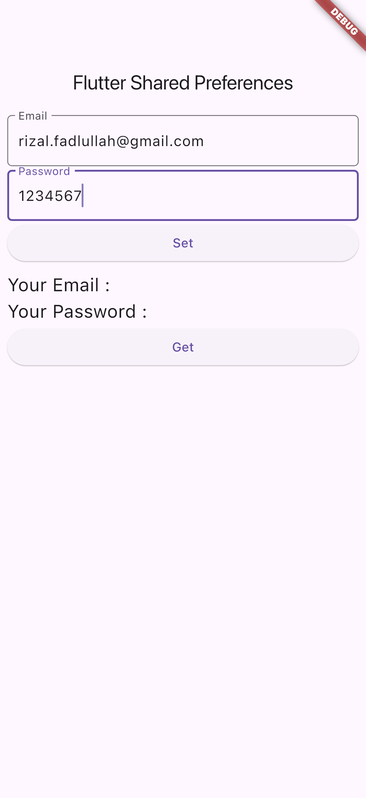
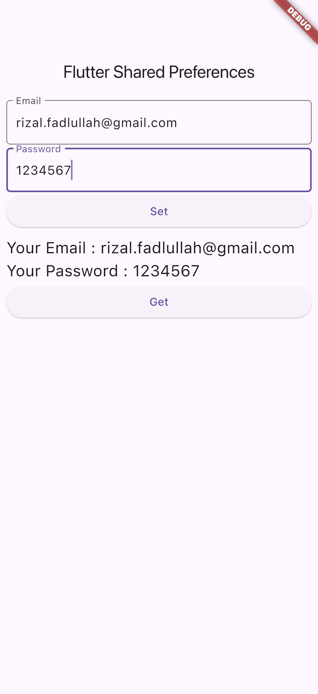

# Latihan_SQLite
## lib/models/contact.dart
```dart
class Contact {
  int id = 0;
  String name = "";
  String phone = "";

  Contact({
    required this.id,
    required this.name,
    required this.phone,
  });

  Contact.fromMap(Map<String, dynamic> contact) {
    id = contact['id'];
    name = contact['name'];
    phone = contact['phone'];
  }

  Map<String, dynamic> toMap() {
    Map<String, dynamic> map = <String, dynamic>{};
    map['id'] = id;
    map['name'] = name;
    map['phone'] = phone;
    return map;
  }
}

```
## lib/main.dart
```dart
import 'package:flutter/material.dart';
import 'package:flutter_driver/driver_extension.dart';
import 'package:shared_preferences/shared_preferences.dart';

void main(){
  enableFlutterDriverExtension();
  runApp(const MyApp());
}

class MyApp extends StatelessWidget {
  const MyApp({super.key});
  @override
  Widget build(BuildContext context) {
    return MaterialApp(
      title: 'Shared Preferences',
      theme: ThemeData(
        primarySwatch: Colors.blue,
      ),
      home: const MyHomePage(),
    );
  }
}

class MyHomePage extends StatefulWidget {
  const MyHomePage({super.key});
  @override
  State<MyHomePage> createState() => _MyHomePageState();
}

class _MyHomePageState extends State<MyHomePage> {
  String? email = "";
  String? password = "";
  TextEditingController emailController = TextEditingController();
  TextEditingController passwordController = TextEditingController();
  @override
  Widget build(BuildContext context) {
    return Scaffold(
      appBar: AppBar(title: const Text('Flutter Shared Preferences')),
      body: ListView(
        padding: const EdgeInsets.all(8.0),
        children: [
          // input email
          TextField(
            key: const ValueKey('tf_email'),
              controller: emailController,
              decoration: InputDecoration(
                  labelText: "Email",
                  border: OutlineInputBorder(
                      borderRadius: BorderRadius.circular(5.0)))),
          const Padding(padding: EdgeInsets.only(top: 4)),
          // input password
          TextField(
            key: const ValueKey('tf_password'),
              controller: passwordController,
              decoration: InputDecoration(
                  labelText: "Password",
                  border: OutlineInputBorder(
                      borderRadius: BorderRadius.circular(5.0)))),
// button untuk menyimpan email dan password ke dalam Shared Preferences melalui method
          // setIntoSharedPreferences()
          ElevatedButton(
            key: const ValueKey('btn_set'),
            child: const Text("Set"),
            onPressed: () {
              setIntoSharedPreferences();
            },
          ),
          const Padding(padding: EdgeInsets.only(top: 8)),
          // Menampilkan Email pada Text Widget
          Text(
            "Your Email : $email",
            style: const TextStyle(fontSize: 20),
            key: const ValueKey('txt_email'),
          ),
          // Menampilkan password pada Text Widget
          Text(
            "Your Password : $password",
            style: const TextStyle(fontSize: 20),
            key: const ValueKey('txt_password'),
          ),
// Button yang berfungsi memanggil method getFromSharedPreferences() untuk menampilkan
          // Email dan Password pada Text Widget
          ElevatedButton(
            key: const ValueKey('btn_get'),
            child: const Text("Get"),
            onPressed: () {
              getFromSharedPreferences();
            },
          ),
        ],
      ),
    );
  }

// method ini berfungsi untuk memasukkan data ke dalam SharedPreferences
  void setIntoSharedPreferences() async {
    SharedPreferences prefs = await SharedPreferences.getInstance();
    await prefs.setString("email", emailController.text);
    await prefs.setString("password", passwordController.text);
  }

// Method ini berfungsi untuk mengambil data Email dan Password dari SharedPreferences
// kemudian dimasukkan ke variable email dan password
  void getFromSharedPreferences() async {
    SharedPreferences prefs = await SharedPreferences.getInstance();
    setState(() {
      email = prefs.getString("email");
      password = prefs.getString("password");
    });
  }
}

```
## OUTPUT
{ width=200px } \ \ 
{ width=200px } \ \ 
{ width=200px } \ \ 
<div style="page-break-after: always\; visibility: hidden">
\pagebreak
</div>

